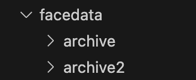

# CS445-Final-Project
Creating an emotion recongition sequential cnn model.

1. Install the requirements in requirments.txt
2. Install the datasets at:
        https://www.kaggle.com/datasets/mh0386/facial-emotion
        https://www.kaggle.com/datasets/ananthu017/emotion-detection-fer?rvi=1
    Put both into a folder called facedata and rename the bottom link to archive2
    The first dataset is high quality images that are good for testing and the last is better for training

    
    

    Should look like this
3. Run singleTest on default to confirm it all works
4. If it fails you can check the yaml file for any missed installs
5. After that you can retrain the data on only other python files in PythonFiles folder or rerun the default 57.py. You can just run the model given 57.th on the whole test set for training by running display.py. You can change the hard coded values for display to run a different model however the values for the model will be different and you will need to change them, same goes for singleTest.py. 
6. All training data is saved in RunsText some runs have the model values to recreate the run with.
